# Shared Layer View

> Auto-generated by novanet v9.0.0. Do not edit manually.

## Overview

The Shared scope contains nodes that are independent of specific projects
but still locale-specific. These are reusable across multiple projects.

**6 nodes organized by domain:**
- **SEO (3)**: SEOKeywordL10n, SEOKeywordMetrics, SEOMiningRun
- **GEO (3)**: GEOSeedL10n, GEOSeedMetrics, GEOMiningRun

**Key insight:**
Shared nodes bridge global locale knowledge and project content.
A keyword like "QR code generator" can be targeted by multiple projects.

**SEO vs GEO:**
- SEO: Traditional search engine optimization (Google, Bing)
- GEO: Generative Engine Optimization (AI answer engines: Perplexity, ChatGPT)

### Legend

| Color | Trait | Description |
|-------|-------|-------------|
| 🔵 Blue | Invariant | Nodes that don't change between locales |
| 🟢 Green | Localized | Nodes with locale-specific content |
| 🟣 Purple | Knowledge | Cultural/linguistic knowledge per locale |
| ⚪ Gray | Derived | Computed/aggregated data |
| ⚙️ Gray | Job | Background processing tasks |

## Graph Diagram

```mermaid
flowchart TB
  %% View: Shared Layer (shared-layer)
  %% 9 nodes, 10 edges

  %% Trait styling (locale_behavior)
  classDef invariant fill:#3b82f6,stroke:#1d4ed8,color:#fff
  classDef localized fill:#22c55e,stroke:#16a34a,color:#fff
  classDef knowledge fill:#8b5cf6,stroke:#7c3aed,color:#fff
  classDef derived fill:#9ca3af,stroke:#6b7280,color:#fff
  classDef job fill:#6b7280,stroke:#4b5563,color:#fff

  subgraph SEO_KEYWORDS["SEO Keywords"]
    SEOKeywordL10n["🟢 SEOKeywordL10n"]
  end

  subgraph SEO_METRICS["SEO Metrics"]
    SEOKeywordMetrics["⚪ SEOKeywordMetrics"]
  end

  subgraph SEO_MINING["SEO Mining"]
  end

  subgraph GEO_SEEDS["GEO Seeds"]
    GEOSeedL10n["🟢 GEOSeedL10n"]
  end

  subgraph GEO_METRICS["GEO Metrics"]
    GEOSeedMetrics["⚪ GEOSeedMetrics"]
  end

  subgraph GEO_MINING["GEO Mining"]
  end

  %% Additional reachable nodes
  BlockL10n["🟢 BlockL10n"]
  ConceptL10n["🟢 ConceptL10n"]
  Locale["🔵 Locale"]
  PageL10n["🟢 PageL10n"]
  ProjectL10n["🟢 ProjectL10n"]

  %% Relationships (styled by edge family)
  BlockL10n -.->|FOR_LOCALE| Locale
  ConceptL10n -.->|FOR_LOCALE| Locale
  GEOSeedL10n -.->|FOR_LOCALE| Locale
  GEOSeedL10n --o|HAS_METRICS| GEOSeedMetrics
  GEOSeedL10n --o|HAS_METRICS| SEOKeywordMetrics
  PageL10n -.->|FOR_LOCALE| Locale
  ProjectL10n -.->|FOR_LOCALE| Locale
  SEOKeywordL10n -.->|FOR_LOCALE| Locale
  SEOKeywordL10n --o|HAS_METRICS| GEOSeedMetrics
  SEOKeywordL10n --o|HAS_METRICS| SEOKeywordMetrics

  %% Edge colors by family
  linkStyle 0,1,2,5,6,7 stroke:#22c55e,stroke-width:2px
  linkStyle 3,4,8,9 stroke:#ec4899,stroke-width:2px

  %% Class assignments
  class BlockL10n localized
  class ConceptL10n localized
  class GEOSeedL10n localized
  class GEOSeedMetrics derived
  class Locale invariant
  class PageL10n localized
  class ProjectL10n localized
  class SEOKeywordL10n localized
  class SEOKeywordMetrics derived
```

## Notes

- Shared nodes are project-independent but locale-specific
- SEO keywords can be targeted by multiple projects' concepts
- GEO seeds track questions asked to AI answer engines
- Metrics are time-series - always use latest for current state
- Mining runs track discovery jobs for both SEO and GEO

---

*Generated by novanet ViewMermaidGenerator — view: shared-layer*
