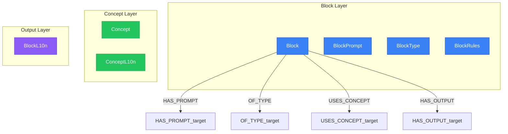

# Block Generation Context

> Generated from `models/views/block-generation.yaml`
> Last updated: 2026-01-30

## Overview

Context loading for sub-agent when generating a single block.
This is the core view for native content generation, providing:
- Block definition with type and rules
- Block-specific prompt instructions
- Related concepts with localized content
- Spreading activation for semantic context


## Graph Diagram



## Nodes

| Node | Layer |
|------|-------|
| Block | Block Layer |
| BlockPrompt | Block Layer |
| BlockType | Block Layer |
| BlockRules | Block Layer |
| Concept | Concept Layer |
| ConceptL10n | Concept Layer |
| BlockL10n | Output Layer |

## Relations

| Relation | Direction |
|----------|-----------|
| HAS_PROMPT | outgoing |
| OF_TYPE | outgoing |
| USES_CONCEPT | outgoing |
| HAS_OUTPUT | outgoing |

## Cypher Queries

### Load block context for generation

Complete context for sub-agent to generate a block

```cypher
MATCH (b:Block {key: $blockKey})
MATCH (b)-[:HAS_PROMPT]->(bp:BlockPrompt)
MATCH (b)-[:OF_TYPE]->(bt:BlockType)
OPTIONAL MATCH (bt)-[:HAS_RULES]->(br:BlockRules)
OPTIONAL MATCH (b)-[:USES_CONCEPT]->(c:Concept)
OPTIONAL MATCH (c)-[:HAS_L10N]->(cl:ConceptL10n)-[:FOR_LOCALE]->(l:Locale {key: $locale})
RETURN b.key AS block,
       bp.instructions AS instructions,
       bt.name AS blockType,
       br.rules AS rules,
       collect(DISTINCT {key: c.key, title: cl.title, definition: cl.definition}) AS concepts
```

**Parameters:**
- `blockKey`: "hero-pricing"
- `locale`: "fr-FR"

### Block with spreading activation

Get related concepts through semantic links

```cypher
MATCH (b:Block {key: $blockKey})-[:USES_CONCEPT]->(c:Concept)
MATCH (c)-[sl:SEMANTIC_LINK*1..2]->(related:Concept)
WHERE ALL(r IN sl WHERE r.temperature >= 0.3)
WITH related, reduce(a = 1.0, r IN sl | a * r.temperature) AS activation
WHERE activation >= 0.3
MATCH (related)-[:HAS_L10N]->(rl:ConceptL10n)-[:FOR_LOCALE]->(l:Locale {key: $locale})
RETURN related.key AS concept,
       rl.title AS title,
       activation
ORDER BY activation DESC
LIMIT 10
```

**Parameters:**
- `blockKey`: "hero-pricing"
- `locale`: "fr-FR"

## Notes

- Sub-agents receive this context to generate ONE block natively
- The LLM context is entirely in the target locale
- Spreading activation provides related concepts for richer context

---

*Generated by NovaNet Unified View System v8.0.0*