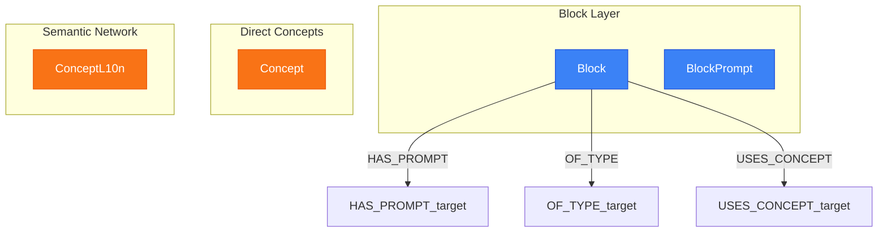

# Spreading Activation View

> Generated from `models/views/block-semantic-network.yaml`
> Last updated: 2026-01-30

## Overview

Demonstrates the spreading activation algorithm for semantic context retrieval.

**How it works:**
1. Start from a Block's USES_CONCEPT relationships
2. Follow SEMANTIC_LINK edges with temperature >= threshold
3. Multiply temperatures along path to compute activation
4. Return concepts with activation >= minimum threshold

**Temperature-based traversal:**
- temperature 1.0 = strong semantic link
- temperature 0.5 = moderate link
- temperature < 0.3 = weak link (often pruned)


## Graph Diagram



## Nodes

| Node | Layer |
|------|-------|
| Block | Block Layer |
| BlockPrompt | Block Layer |
| Concept | Direct Concepts |
| Concept | Semantic Network |
| ConceptL10n | Semantic Network |

## Relations

| Relation | Direction |
|----------|-----------|
| HAS_PROMPT | outgoing |
| OF_TYPE | outgoing |
| USES_CONCEPT | outgoing |

## Cypher Queries

### Basic spreading activation

Get related concepts with minimum activation 0.3

```cypher
MATCH (b:Block {key: $blockKey})-[:USES_CONCEPT]->(c:Concept)
MATCH (c)-[sl:SEMANTIC_LINK*1..2]->(related:Concept)
WHERE ALL(r IN sl WHERE r.temperature >= 0.3)
WITH related, reduce(a = 1.0, r IN sl | a * r.temperature) AS activation
WHERE activation >= 0.3
RETURN DISTINCT related.key AS concept, activation
ORDER BY activation DESC
```

**Parameters:**
- `blockKey`: "hero-pricing"

### Spreading with localized content

Get activated concepts with their localized content

```cypher
MATCH (b:Block {key: $blockKey})-[:USES_CONCEPT]->(c:Concept)
MATCH (c)-[sl:SEMANTIC_LINK*1..2]->(related:Concept)
WHERE ALL(r IN sl WHERE r.temperature >= $minTemp)
WITH related, reduce(a = 1.0, r IN sl | a * r.temperature) AS activation
WHERE activation >= $minActivation
MATCH (related)-[:HAS_L10N]->(rl:ConceptL10n)-[:FOR_LOCALE]->(l:Locale {key: $locale})
RETURN related.key AS concept,
       rl.title AS title,
       rl.definition AS definition,
       activation
ORDER BY activation DESC
LIMIT 10
```

**Parameters:**
- `blockKey`: "hero-pricing"
- `locale`: "fr-FR"
- `minTemp`: 0.3
- `minActivation`: 0.3

### Activation path analysis

Show the path and temperature at each hop

```cypher
MATCH (b:Block {key: $blockKey})-[:USES_CONCEPT]->(c:Concept)
MATCH path = (c)-[sl:SEMANTIC_LINK*1..2]->(related:Concept)
WITH related, path, [r IN sl | r.temperature] AS temps
RETURN c.key AS source,
       related.key AS target,
       length(path) AS hops,
       temps,
       reduce(a = 1.0, t IN temps | a * t) AS activation
ORDER BY activation DESC
LIMIT 20
```

**Parameters:**
- `blockKey`: "hero-pricing"

## Notes

- Temperature threshold of 0.3 is the default minimum
- Activation = product of temperatures along path
- Maximum depth is typically 2 hops to avoid noise
- Used by sub-agents to enrich generation context

---

*Generated by NovaNet Unified View System v8.0.0*