# Complete Graph View

> Generated from `models/relations.yaml` + `models/_index.yaml`
> Last updated: 2026-01-30
> Version: v8.2.0 (synced)

## Overview

The complete NovaNet graph showing all **35 node types** organized into three scopes:
- **Global (15 nodes)**: Locale + 14 LocaleKnowledge nodes, shared across all projects
- **Shared (6 nodes)**: SEO/GEO nodes, independent of projects
- **Project (14 nodes)**: Per-project foundation, structure, semantic, instruction, and output nodes

## Graph Diagram

```mermaid
flowchart TB
  %% NovaNet Graph v8.2.0 (SYNCED with YAML sources)
  %% Source: relations.yaml + _index.yaml
  %% Nodes: 35 | Relations: 47 (excluding inverses)

  %% Locale behavior styling
  classDef invariant fill:#3b82f6,stroke:#1d4ed8,color:#fff
  classDef localized fill:#22c55e,stroke:#16a34a,color:#fff
  classDef localeKnowledge fill:#8b5cf6,stroke:#7c3aed,color:#fff
  classDef derived fill:#9ca3af,stroke:#6b7280,color:#fff
  classDef job fill:#6b7280,stroke:#4b5563,color:#fff

  %% ═══════════════════════════════════════════════════════════════════════════
  %% GLOBAL SCOPE (15 nodes)
  %% ═══════════════════════════════════════════════════════════════════════════

  subgraph GLOBAL_LAYER["🌍 GLOBAL (15 nodes)"]
    direction TB
    subgraph GLOBAL_config["Config (1)"]
      Locale["🔵 Locale"]
    end
    subgraph GLOBAL_knowledge["Knowledge (14)"]
      LocaleIdentity["🟣 LocaleIdentity"]
      LocaleVoice["🟣 LocaleVoice"]
      LocaleCulture["🟣 LocaleCulture"]
      LocaleCultureReferences["🟣 LocaleCultureReferences"]
      LocaleMarket["🟣 LocaleMarket"]
      LocaleLexicon["🟣 LocaleLexicon"]
      LocaleRulesAdaptation["🟣 LocaleRulesAdaptation"]
      LocaleRulesFormatting["🟣 LocaleRulesFormatting"]
      LocaleRulesSlug["🟣 LocaleRulesSlug"]
      Expression["🟣 Expression"]
      Reference["🟣 Reference"]
      Metaphor["🟣 Metaphor"]
      Pattern["🟣 Pattern"]
      Constraint["🟣 Constraint"]
    end
  end

  %% ═══════════════════════════════════════════════════════════════════════════
  %% SHARED SCOPE (6 nodes)
  %% ═══════════════════════════════════════════════════════════════════════════

  subgraph SHARED_LAYER["🎯 SHARED (6 nodes)"]
    direction TB
    subgraph SHARED_seo["SEO (3)"]
      SEOKeywordL10n["🟢 SEOKeywordL10n"]
      SEOKeywordMetrics["⚪ SEOKeywordMetrics"]
      SEOMiningRun["⚙️ SEOMiningRun"]
    end
    subgraph SHARED_geo["GEO (3)"]
      GEOSeedL10n["🟢 GEOSeedL10n"]
      GEOSeedMetrics["⚪ GEOSeedMetrics"]
      GEOMiningRun["⚙️ GEOMiningRun"]
    end
  end

  %% ═══════════════════════════════════════════════════════════════════════════
  %% PROJECT SCOPE (14 nodes)
  %% ═══════════════════════════════════════════════════════════════════════════

  subgraph PROJECT_LAYER["📦 PROJECT (14 nodes)"]
    direction TB
    subgraph PROJECT_foundation["Foundation (3)"]
      Project["🔵 Project"]
      BrandIdentity["🔵 BrandIdentity"]
      ProjectL10n["🟢 ProjectL10n"]
    end
    subgraph PROJECT_structure["Structure (2)"]
      Page["🔵 Page"]
      Block["🔵 Block"]
    end
    subgraph PROJECT_semantic["Semantic (2)"]
      Concept["🔵 Concept"]
      ConceptL10n["🟢 ConceptL10n"]
    end
    subgraph PROJECT_instruction["Instruction (5)"]
      PageType["🔵 PageType"]
      PagePrompt["🔵 PagePrompt"]
      BlockType["🔵 BlockType"]
      BlockPrompt["🔵 BlockPrompt"]
      BlockRules["🔵 BlockRules"]
    end
    subgraph PROJECT_output["Output (2)"]
      PageL10n["🟢 PageL10n"]
      BlockL10n["🟢 BlockL10n"]
    end
  end

  %% ═══════════════════════════════════════════════════════════════════════════
  %% RELATIONS: PROJECT ROOT (from relations.yaml)
  %% ═══════════════════════════════════════════════════════════════════════════

  Project -->|HAS_CONCEPT| Concept
  Project -->|HAS_PAGE| Page
  Project -->|HAS_BRAND_IDENTITY| BrandIdentity
  Project -.->|SUPPORTS_LOCALE| Locale
  Project -.->|DEFAULT_LOCALE| Locale
  Project -.->|HAS_L10N| ProjectL10n

  %% ═══════════════════════════════════════════════════════════════════════════
  %% RELATIONS: LOCALE KNOWLEDGE (from relations.yaml)
  %% ═══════════════════════════════════════════════════════════════════════════

  Locale -.->|FALLBACK_TO| Locale
  Locale -.->|VARIANT_OF| Locale
  Locale -->|HAS_IDENTITY| LocaleIdentity
  Locale -->|HAS_VOICE| LocaleVoice
  Locale -->|HAS_CULTURE| LocaleCulture
  Locale -->|HAS_MARKET| LocaleMarket
  Locale -->|HAS_LEXICON| LocaleLexicon
  Locale -->|HAS_RULES_ADAPTATION| LocaleRulesAdaptation
  Locale -->|HAS_RULES_FORMATTING| LocaleRulesFormatting
  Locale -->|HAS_RULES_SLUG| LocaleRulesSlug

  LocaleCulture -->|HAS_CULTURE_REFERENCES| LocaleCultureReferences
  LocaleCulture -->|HAS_CONSTRAINT| Constraint
  LocaleCultureReferences -->|HAS_REFERENCE| Reference
  LocaleCultureReferences -->|HAS_METAPHOR| Metaphor
  LocaleLexicon -->|HAS_EXPRESSION| Expression
  LocaleRulesFormatting -->|HAS_PATTERN| Pattern

  %% ═══════════════════════════════════════════════════════════════════════════
  %% RELATIONS: PAGE STRUCTURE (from relations.yaml)
  %% ═══════════════════════════════════════════════════════════════════════════

  Page -->|OF_TYPE| PageType
  Page -->|HAS_BLOCK| Block
  Page ==>|HAS_PROMPT| PagePrompt
  Page -.->|USES_CONCEPT| Concept
  Page -.->|HAS_OUTPUT| PageL10n
  Page -.->|LINKS_TO| Page
  Page -->|SUBTOPIC_OF| Page

  %% ═══════════════════════════════════════════════════════════════════════════
  %% RELATIONS: BLOCK STRUCTURE (from relations.yaml)
  %% ═══════════════════════════════════════════════════════════════════════════

  Block -->|OF_TYPE| BlockType
  Block ==>|HAS_PROMPT| BlockPrompt
  Block -.->|USES_CONCEPT| Concept
  Block -.->|HAS_OUTPUT| BlockL10n

  BlockType -->|HAS_RULES| BlockRules

  %% ═══════════════════════════════════════════════════════════════════════════
  %% RELATIONS: CONCEPT & L10N (from relations.yaml)
  %% ═══════════════════════════════════════════════════════════════════════════

  Concept -.->|HAS_L10N| ConceptL10n
  Concept -.->|SEMANTIC_LINK| Concept
  Concept --o|TARGETS_SEO| SEOKeywordL10n
  Concept --o|TARGETS_GEO| GEOSeedL10n

  ConceptL10n --o|HAS_SEO_TARGET| SEOKeywordL10n
  ConceptL10n --o|HAS_GEO_TARGET| GEOSeedL10n

  %% ═══════════════════════════════════════════════════════════════════════════
  %% RELATIONS: FOR_LOCALE (all L10n → Locale)
  %% ═══════════════════════════════════════════════════════════════════════════

  ProjectL10n -.->|FOR_LOCALE| Locale
  ConceptL10n -.->|FOR_LOCALE| Locale
  PageL10n -.->|FOR_LOCALE| Locale
  BlockL10n -.->|FOR_LOCALE| Locale
  SEOKeywordL10n -.->|FOR_LOCALE| Locale
  GEOSeedL10n -.->|FOR_LOCALE| Locale

  %% ═══════════════════════════════════════════════════════════════════════════
  %% RELATIONS: OUTPUT & PROVENANCE (from relations.yaml)
  %% ═══════════════════════════════════════════════════════════════════════════

  PagePrompt ==>|GENERATED| PageL10n
  BlockPrompt ==>|GENERATED| BlockL10n

  PageL10n ==>|ASSEMBLES| BlockL10n
  PageL10n -->|BELONGS_TO_PROJECT_L10N| ProjectL10n
  PageL10n ==>|PREVIOUS_VERSION| PageL10n

  BlockL10n ==>|INFLUENCED_BY| ConceptL10n
  BlockL10n ==>|GENERATED_FROM| BlockType
  BlockL10n ==>|PREVIOUS_VERSION| BlockL10n

  %% ═══════════════════════════════════════════════════════════════════════════
  %% RELATIONS: SEO/GEO METRICS & MINING (from relations.yaml)
  %% ═══════════════════════════════════════════════════════════════════════════

  SEOKeywordL10n -->|HAS_METRICS| SEOKeywordMetrics
  GEOSeedL10n -->|HAS_METRICS| GEOSeedMetrics

  SEOMiningRun --o|SEO_MINES| SEOKeywordL10n
  GEOMiningRun --o|GEO_MINES| GEOSeedL10n

  %% ═══════════════════════════════════════════════════════════════════════════
  %% CLASS ASSIGNMENTS (from _index.yaml nodes_by_locale_behavior)
  %% ═══════════════════════════════════════════════════════════════════════════

  %% Invariant (11 nodes)
  class Project,BrandIdentity,Concept,Page,Block,PageType,BlockType,PagePrompt,BlockPrompt,BlockRules,Locale invariant

  %% Localized (6 nodes)
  class ProjectL10n,ConceptL10n,PageL10n,BlockL10n,SEOKeywordL10n,GEOSeedL10n localized

  %% LocaleKnowledge (14 nodes)
  class LocaleIdentity,LocaleVoice,LocaleCulture,LocaleCultureReferences,LocaleMarket,LocaleLexicon,LocaleRulesAdaptation,LocaleRulesFormatting,LocaleRulesSlug,Expression,Reference,Metaphor,Pattern,Constraint localeKnowledge

  %% Derived (2 nodes)
  class SEOKeywordMetrics,GEOSeedMetrics derived

  %% Job (2 nodes)
  class SEOMiningRun,GEOMiningRun job
```



## Nodes by Scope (35 total)

### Global Scope (15 nodes)

| Node | Category | Locale Behavior |
|------|----------|-----------------|
| Locale | config | invariant |
| LocaleIdentity | knowledge | localeKnowledge |
| LocaleVoice | knowledge | localeKnowledge |
| LocaleCulture | knowledge | localeKnowledge |
| LocaleCultureReferences | knowledge | localeKnowledge |
| LocaleMarket | knowledge | localeKnowledge |
| LocaleLexicon | knowledge | localeKnowledge |
| LocaleRulesAdaptation | knowledge | localeKnowledge |
| LocaleRulesFormatting | knowledge | localeKnowledge |
| LocaleRulesSlug | knowledge | localeKnowledge |
| Expression | knowledge | localeKnowledge |
| Reference | knowledge | localeKnowledge |
| Metaphor | knowledge | localeKnowledge |
| Pattern | knowledge | localeKnowledge |
| Constraint | knowledge | localeKnowledge |

### Project Scope (14 nodes)

| Node | Category | Locale Behavior |
|------|----------|-----------------|
| Project | foundation | invariant |
| BrandIdentity | foundation | invariant |
| ProjectL10n | foundation | localized |
| Page | structure | invariant |
| Block | structure | invariant |
| Concept | semantic | invariant |
| ConceptL10n | semantic | localized |
| PageType | instruction | invariant |
| PagePrompt | instruction | invariant |
| BlockType | instruction | invariant |
| BlockPrompt | instruction | invariant |
| BlockRules | instruction | invariant |
| PageL10n | output | localized |
| BlockL10n | output | localized |

### Shared Scope (6 nodes)

| Node | Category | Locale Behavior |
|------|----------|-----------------|
| SEOKeywordL10n | seo | localized |
| SEOKeywordMetrics | seo | derived |
| SEOMiningRun | seo | job |
| GEOSeedL10n | geo | localized |
| GEOSeedMetrics | geo | derived |
| GEOMiningRun | geo | job |

## Key Relations (47 total)

### Semantic Relations (used in spreading activation)

| Relation | From | To | Props |
|----------|------|-----|-------|
| SEMANTIC_LINK | Concept | Concept | type, temperature |
| USES_CONCEPT | Page, Block | Concept | purpose, temperature |
| INFLUENCED_BY | BlockL10n | ConceptL10n | weight, concept_version |
| HAS_L10N | Concept, Project | ConceptL10n, ProjectL10n | - |
| HAS_OUTPUT | Page, Block | PageL10n, BlockL10n | - |
| FOR_LOCALE | *L10n | Locale | - |
| HAS_SEO_TARGET | ConceptL10n | SEOKeywordL10n | role, priority |
| HAS_GEO_TARGET | ConceptL10n | GEOSeedL10n | role, priority |

### Structural Relations

| Relation | From | To | Props |
|----------|------|-----|-------|
| HAS_CONCEPT | Project | Concept | - |
| HAS_PAGE | Project | Page | - |
| HAS_BRAND_IDENTITY | Project | BrandIdentity | - |
| SUPPORTS_LOCALE | Project | Locale | status |
| DEFAULT_LOCALE | Project | Locale | - |
| HAS_BLOCK | Page | Block | position |
| OF_TYPE | Page, Block | PageType, BlockType | - |
| HAS_PROMPT | Page, Block | PagePrompt, BlockPrompt | - |
| HAS_RULES | BlockType | BlockRules | - |

### Page-to-Page Relations (v7.12.0)

| Relation | From | To | Props |
|----------|------|-----|-------|
| LINKS_TO | Page | Page | concept_key, context, seo_weight, anchor_type, nofollow |
| SUBTOPIC_OF | Page | Page | - |

### Locale Knowledge Relations

| Relation | From | To |
|----------|------|-----|
| HAS_IDENTITY | Locale | LocaleIdentity |
| HAS_VOICE | Locale | LocaleVoice |
| HAS_CULTURE | Locale | LocaleCulture |
| HAS_MARKET | Locale | LocaleMarket |
| HAS_LEXICON | Locale | LocaleLexicon |
| HAS_RULES_ADAPTATION | Locale | LocaleRulesAdaptation |
| HAS_RULES_FORMATTING | Locale | LocaleRulesFormatting |
| HAS_RULES_SLUG | Locale | LocaleRulesSlug |
| HAS_CULTURE_REFERENCES | LocaleCulture | LocaleCultureReferences |
| HAS_REFERENCE | LocaleCultureReferences | Reference |
| HAS_METAPHOR | LocaleCultureReferences | Metaphor |
| HAS_CONSTRAINT | LocaleCulture | Constraint |
| HAS_EXPRESSION | LocaleLexicon | Expression |
| HAS_PATTERN | LocaleRulesFormatting | Pattern |
| FALLBACK_TO | Locale | Locale |
| VARIANT_OF | Locale | Locale |

### Output & Provenance Relations

| Relation | From | To | Props |
|----------|------|-----|-------|
| GENERATED | PagePrompt, BlockPrompt | PageL10n, BlockL10n | generated_at |
| ASSEMBLES | PageL10n | BlockL10n | position |
| BELONGS_TO_PROJECT_L10N | PageL10n | ProjectL10n | - |
| PREVIOUS_VERSION | PageL10n, BlockL10n | PageL10n, BlockL10n | - |
| GENERATED_FROM | BlockL10n | BlockType | - |

### SEO/GEO Relations

| Relation | From | To | Props |
|----------|------|-----|-------|
| TARGETS_SEO | Concept | SEOKeywordL10n | status, priority |
| TARGETS_GEO | Concept | GEOSeedL10n | status, priority |
| HAS_METRICS | SEOKeywordL10n, GEOSeedL10n | SEOKeywordMetrics, GEOSeedMetrics | - |
| SEO_MINES | SEOMiningRun | SEOKeywordL10n | - |
| GEO_MINES | GEOMiningRun | GEOSeedL10n | - |

### Inverse Relations (v7.8.0)

| Relation | From | To | Inverse Of |
|----------|------|-----|------------|
| L10N_OF | ConceptL10n, ProjectL10n | Concept, Project | HAS_L10N |
| OUTPUT_OF | PageL10n, BlockL10n | Page, Block | HAS_OUTPUT |
| BLOCK_OF | Block | Page | HAS_BLOCK |
| USED_BY | Concept | Page, Block | USES_CONCEPT |
| HAS_LOCALIZED_CONTENT | Locale | *L10n | FOR_LOCALE |

## Cypher Queries

### Count all nodes by type

```cypher
MATCH (n)
RETURN labels(n)[0] AS label, count(*) AS count
ORDER BY count DESC
```

### Get project with all pages and blocks

```cypher
MATCH (p:Project {key: $projectKey})
OPTIONAL MATCH (p)-[:HAS_PAGE]->(page:Page)-[hb:HAS_BLOCK]->(block:Block)
RETURN p.key AS project,
       collect(DISTINCT {
         page: page.key,
         blocks: collect({key: block.key, position: hb.position})
       }) AS structure
```

### Full graph statistics

```cypher
CALL {
  MATCH (n) RETURN count(n) AS nodeCount
}
CALL {
  MATCH ()-[r]->() RETURN count(r) AS relCount
}
RETURN nodeCount, relCount
```

### Load block generation context

```cypher
MATCH (b:Block {key: $blockKey})-[:OF_TYPE]->(bt:BlockType)
MATCH (b)-[:USES_CONCEPT]->(c:Concept)-[:HAS_L10N]->(cl:ConceptL10n)-[:FOR_LOCALE]->(l:Locale {key: $locale})
OPTIONAL MATCH (l)-[:HAS_VOICE]->(v:LocaleVoice)
OPTIONAL MATCH (l)-[:HAS_LEXICON]->(lex:LocaleLexicon)-[:HAS_EXPRESSION]->(e:Expression)
WHERE e.semantic_field IN ['urgency', 'value']
RETURN b, bt, collect(DISTINCT cl) AS concepts, v AS voice, collect(e.text) AS expressions
```

## Notes

- This view is auto-generated from `relations.yaml` and `_index.yaml`
- **Source of truth**: `packages/core/models/*.yaml`
- For generation tasks, use specific views (page-generation, block-generation)
- The graph follows scope hierarchy: Global > Shared > Project
- Inverse relations are optional (for bidirectional queries)

---

*Generated by NovaNet Unified View System v8.2.0*
*Synced with YAML sources: 2026-01-30*
