# Complete Graph View

> Generated from `models/views/complete-graph.yaml`
> Last updated: 2026-01-30

## Overview

The complete NovaNet graph showing all 35 node types organized into three scopes:
- **Global (15 nodes)**: Locale + 14 LocaleKnowledge nodes, shared across all projects
- **Shared (6 nodes)**: SEO/GEO nodes, independent of projects
- **Project (14 nodes)**: Per-project foundation, structure, semantic, and output nodes


## Graph Diagram

```mermaid
flowchart TB
  %% NovaNet Graph v8.1.0
  %% Generated: 35 nodes, 66 edges
  %% Source: relations.yaml + _index.yaml (with semantic edge styling)

  %% Locale behavior styling
  classDef invariant fill:#3b82f6,stroke:#1d4ed8,color:#fff
  classDef localized fill:#22c55e,stroke:#16a34a,color:#fff
  classDef localeKnowledge fill:#8b5cf6,stroke:#7c3aed,color:#fff
  classDef derived fill:#9ca3af,stroke:#6b7280,color:#fff
  classDef job fill:#6b7280,stroke:#4b5563,color:#fff

  subgraph GLOBAL_LAYER["🌍 GLOBAL"]
    direction TB
    subgraph GLOBAL_config["Config"]
      Locale["🔵 Locale"]
    end
    subgraph GLOBAL_knowledge["Knowledge"]
      Constraint["🟣 Constraint"]
      Expression["🟣 Expression"]
      LocaleCulture["🟣 LocaleCulture"]
      LocaleCultureReferences["🟣 LocaleCultureReferences"]
      LocaleIdentity["🟣 LocaleIdentity"]
      LocaleLexicon["🟣 LocaleLexicon"]
      LocaleMarket["🟣 LocaleMarket"]
      LocaleRulesAdaptation["🟣 LocaleRulesAdaptation"]
      LocaleRulesFormatting["🟣 LocaleRulesFormatting"]
      LocaleRulesSlug["🟣 LocaleRulesSlug"]
      LocaleVoice["🟣 LocaleVoice"]
      Metaphor["🟣 Metaphor"]
      Pattern["🟣 Pattern"]
      Reference["🟣 Reference"]
    end
  end

  subgraph SHARED_LAYER["🎯 SHARED"]
    direction TB
    subgraph SHARED_geo["GEO"]
      GEOMiningRun["⚙️ GEOMiningRun"]
      GEOSeedL10n["🟢 GEOSeedL10n"]
      GEOSeedMetrics["⚪ GEOSeedMetrics"]
    end
    subgraph SHARED_seo["SEO"]
      SEOKeywordL10n["🟢 SEOKeywordL10n"]
      SEOKeywordMetrics["⚪ SEOKeywordMetrics"]
      SEOMiningRun["⚙️ SEOMiningRun"]
    end
  end

  subgraph PROJECT_LAYER["📦 PROJECT"]
    direction TB
    subgraph PROJECT_foundation["Foundation"]
      BrandIdentity["🔵 BrandIdentity"]
      Project["🔵 Project"]
      ProjectL10n["🟢 ProjectL10n"]
    end
    subgraph PROJECT_instruction["Instruction"]
      BlockPrompt["🔵 BlockPrompt"]
      BlockRules["🔵 BlockRules"]
      BlockType["🔵 BlockType"]
      PagePrompt["🔵 PagePrompt"]
      PageType["🔵 PageType"]
    end
    subgraph PROJECT_output["Output"]
      BlockL10n["🟢 BlockL10n"]
      PageL10n["🟢 PageL10n"]
    end
    subgraph PROJECT_semantic["Semantic"]
      Concept["🔵 Concept"]
      ConceptL10n["🟢 ConceptL10n"]
    end
    subgraph PROJECT_structure["Structure"]
      Block["🔵 Block"]
      Page["🔵 Page"]
    end
  end

  %% Relationships (styled by edge category)
  Block -.->|HAS_OUTPUT| BlockL10n
  Block -.->|HAS_OUTPUT| PageL10n
  Block ==>|HAS_PROMPT| BlockPrompt
  Block ==>|HAS_PROMPT| PagePrompt
  Block -->|OF_TYPE| BlockType
  Block -->|OF_TYPE| PageType
  Block -.->|USES_CONCEPT| Concept
  BlockL10n ==>|GENERATED_FROM| BlockType
  BlockL10n ==>|INFLUENCED_BY| ConceptL10n
  BlockL10n ==>|PREVIOUS_VERSION| BlockL10n
  BlockL10n ==>|PREVIOUS_VERSION| PageL10n
  BlockPrompt ==>|GENERATED| BlockL10n
  BlockPrompt ==>|GENERATED| PageL10n
  BlockType -->|HAS_RULES| BlockRules
  Concept -.->|HAS_L10N| ConceptL10n
  Concept -.->|HAS_L10N| ProjectL10n
  Concept -.->|SEMANTIC_LINK| Concept
  Concept --o|TARGETS_GEO| GEOSeedL10n
  Concept --o|TARGETS_SEO| SEOKeywordL10n
  ConceptL10n --o|HAS_GEO_TARGET| GEOSeedL10n
  ConceptL10n --o|HAS_SEO_TARGET| SEOKeywordL10n
  GEOMiningRun --o|GEO_MINES| GEOSeedL10n
  GEOSeedL10n -->|HAS_METRICS| GEOSeedMetrics
  GEOSeedL10n -->|HAS_METRICS| SEOKeywordMetrics
  Locale -.->|FALLBACK_TO| Locale
  Locale -->|HAS_CULTURE| LocaleCulture
  Locale -->|HAS_IDENTITY| LocaleIdentity
  Locale -->|HAS_LEXICON| LocaleLexicon
  Locale -->|HAS_MARKET| LocaleMarket
  Locale -->|HAS_RULES_ADAPTATION| LocaleRulesAdaptation
  Locale -->|HAS_RULES_FORMATTING| LocaleRulesFormatting
  Locale -->|HAS_RULES_SLUG| LocaleRulesSlug
  Locale -->|HAS_VOICE| LocaleVoice
  Locale -.->|VARIANT_OF| Locale
  LocaleCulture -->|HAS_CONSTRAINT| Constraint
  LocaleCulture -->|HAS_CULTURE_REFERENCES| LocaleCultureReferences
  LocaleCultureReferences -->|HAS_METAPHOR| Metaphor
  LocaleCultureReferences -->|HAS_REFERENCE| Reference
  LocaleLexicon -->|HAS_EXPRESSION| Expression
  LocaleRulesFormatting -->|HAS_PATTERN| Pattern
  Page -->|HAS_BLOCK| Block
  Page -.->|HAS_OUTPUT| BlockL10n
  Page -.->|HAS_OUTPUT| PageL10n
  Page ==>|HAS_PROMPT| BlockPrompt
  Page ==>|HAS_PROMPT| PagePrompt
  Page -.->|LINKS_TO| Page
  Page -->|OF_TYPE| BlockType
  Page -->|OF_TYPE| PageType
  Page -->|SUBTOPIC_OF| Page
  Page -.->|USES_CONCEPT| Concept
  PageL10n ==>|ASSEMBLES| BlockL10n
  PageL10n -->|BELONGS_TO_PROJECT_L10N| ProjectL10n
  PageL10n ==>|PREVIOUS_VERSION| BlockL10n
  PageL10n ==>|PREVIOUS_VERSION| PageL10n
  PagePrompt ==>|GENERATED| BlockL10n
  PagePrompt ==>|GENERATED| PageL10n
  Project -.->|DEFAULT_LOCALE| Locale
  Project -->|HAS_BRAND_IDENTITY| BrandIdentity
  Project -->|HAS_CONCEPT| Concept
  Project -.->|HAS_L10N| ConceptL10n
  Project -.->|HAS_L10N| ProjectL10n
  Project -->|HAS_PAGE| Page
  Project -.->|SUPPORTS_LOCALE| Locale
  SEOKeywordL10n -->|HAS_METRICS| GEOSeedMetrics
  SEOKeywordL10n -->|HAS_METRICS| SEOKeywordMetrics
  SEOMiningRun --o|SEO_MINES| SEOKeywordL10n

  %% Edge colors by category
  linkStyle 2,3,7,8,9,10,11,12,43,44,50,52,53,54,55 stroke:#8b5cf6,stroke-width:2px
  linkStyle 4,5,13,46,47,48 stroke:#06b6d4,stroke-width:2px
  linkStyle 51 stroke:#6b7280,stroke-width:2px
  linkStyle 0,1,14,15,24,33,41,42,56,59,60,62 stroke:#22c55e,stroke-width:2px
  linkStyle 22,23,25,26,27,28,29,30,31,32,34,35,36,37,38,39,40,57,58,61,63,64 stroke:#3b82f6,stroke-width:2px
  linkStyle 6,16,45,49 stroke:#f97316,stroke-width:2px
  linkStyle 17,18,19,20,21,65 stroke:#ec4899,stroke-width:2px

  %% Class assignments
  class Block invariant
  class BlockL10n localized
  class BlockPrompt invariant
  class BlockRules invariant
  class BlockType invariant
  class BrandIdentity invariant
  class Concept invariant
  class ConceptL10n localized
  class Constraint localeKnowledge
  class Expression localeKnowledge
  class GEOMiningRun job
  class GEOSeedL10n localized
  class GEOSeedMetrics derived
  class Locale invariant
  class LocaleCulture localeKnowledge
  class LocaleCultureReferences localeKnowledge
  class LocaleIdentity localeKnowledge
  class LocaleLexicon localeKnowledge
  class LocaleMarket localeKnowledge
  class LocaleRulesAdaptation localeKnowledge
  class LocaleRulesFormatting localeKnowledge
  class LocaleRulesSlug localeKnowledge
  class LocaleVoice localeKnowledge
  class Metaphor localeKnowledge
  class Page invariant
  class PageL10n localized
  class PagePrompt invariant
  class PageType invariant
  class Pattern localeKnowledge
  class Project invariant
  class ProjectL10n localized
  class Reference localeKnowledge
  class SEOKeywordL10n localized
  class SEOKeywordMetrics derived
  class SEOMiningRun job
```



## Nodes

| Node | Layer |
|------|-------|
| Locale | Global Layer |
| LocaleIdentity | Global Layer |
| LocaleVoice | Global Layer |
| LocaleCulture | Global Layer |
| LocaleMarket | Global Layer |
| LocaleLexicon | Global Layer |
| Expression | Global Layer |
| Project | Project Layer |
| BrandIdentity | Project Layer |
| ProjectL10n | Project Layer |
| Page | Content Layer |
| Block | Content Layer |
| BlockType | Content Layer |
| Concept | Content Layer |
| ConceptL10n | Content Layer |
| PagePrompt | Generation Layer |
| BlockPrompt | Generation Layer |
| BlockRules | Generation Layer |
| PageL10n | Generation Layer |
| BlockL10n | Generation Layer |
| SEOKeywordL10n | Mining Layer |
| SEOKeywordMetrics | Mining Layer |
| SEOMiningRun | Mining Layer |
| GEOSeedL10n | Mining Layer |
| GEOSeedMetrics | Mining Layer |
| GEOMiningRun | Mining Layer |

## Relations

| Relation | Direction |
|----------|-----------|
| HAS_BRAND_IDENTITY | outgoing |
| HAS_L10N | outgoing |
| SUPPORTS_LOCALE | outgoing |
| DEFAULT_LOCALE | outgoing |
| HAS_PAGE | outgoing |
| HAS_CONCEPT | outgoing |

## Cypher Queries

### Count all nodes by type

Get node counts for each label in the graph

```cypher
MATCH (n)
RETURN labels(n)[0] AS label, count(*) AS count
ORDER BY count DESC
```

### Get project with all pages

Load a project and its page structure

```cypher
MATCH (p:Project {key: $projectKey})
OPTIONAL MATCH (p)-[:HAS_PAGE]->(page:Page)
RETURN p.key AS project,
       collect(page.key) AS pages
```

**Parameters:**
- `projectKey`: "qrcode-ai"

### Full graph statistics

Overview of all node and relationship counts

```cypher
CALL {
  MATCH (n) RETURN count(n) AS nodeCount
}
CALL {
  MATCH ()-[r]->() RETURN count(r) AS relCount
}
RETURN nodeCount, relCount
```

## Notes

- This view is for documentation and understanding the full schema
- For generation tasks, use more specific views like page-generation or block-generation
- The graph follows a scope hierarchy: Global > Shared > Project
- Mermaid diagram is auto-generated from relations.yaml via MermaidGenerator

---

*Generated by NovaNet Unified View System v8.1.0*