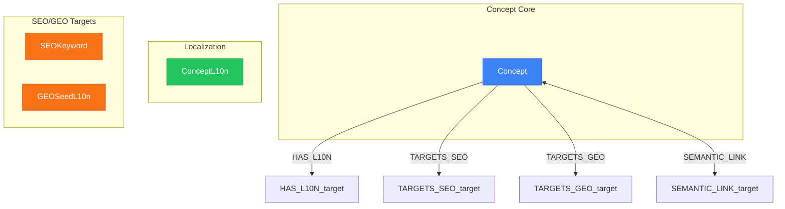

# Concept Network View

> Generated from `models/views/concept-ecosystem.yaml`
> Last updated: 2026-01-30

## Overview

The concept network showing semantic relationships between concepts.
Concepts are the core semantic building blocks of NovaNet:
- Each Concept has localized versions (ConceptL10n) per locale
- Concepts connect via SEMANTIC_LINK with temperature weights
- Concepts can target SEO keywords and GEO seeds


## Graph Diagram



## Nodes

| Node | Layer |
|------|-------|
| Concept | Concept Core |
| ConceptL10n | Localization |
| SEOKeyword | SEO/GEO Targets |
| GEOSeedL10n | SEO/GEO Targets |

## Relations

| Relation | Direction |
|----------|-----------|
| HAS_L10N | outgoing |
| TARGETS_SEO | outgoing |
| TARGETS_GEO | outgoing |
| SEMANTIC_LINK | both |

## Cypher Queries

### Concept with all localizations

Get a concept with all its localized versions

```cypher
MATCH (c:Concept {key: $conceptKey})
OPTIONAL MATCH (c)-[:HAS_L10N]->(cl:ConceptL10n)-[:FOR_LOCALE]->(l:Locale)
RETURN c.key AS concept,
       c.llm_context AS context,
       collect({locale: l.key, title: cl.title, definition: cl.definition}) AS localizations
```

**Parameters:**
- `conceptKey`: "tier-pro"

### Concept semantic network

Get related concepts via semantic links

```cypher
MATCH (c:Concept {key: $conceptKey})
OPTIONAL MATCH (c)-[sl:SEMANTIC_LINK]-(related:Concept)
RETURN c.key AS concept,
       collect({
         related: related.key,
         temperature: sl.temperature,
         direction: CASE WHEN startNode(sl) = c THEN 'outgoing' ELSE 'incoming' END
       }) AS semanticLinks
```

**Parameters:**
- `conceptKey`: "tier-pro"

### Concept SEO/GEO targets

Get SEO keywords and GEO seeds targeted by a concept

```cypher
MATCH (c:Concept {key: $conceptKey})
OPTIONAL MATCH (c)-[:TARGETS_SEO]->(seo:SEOKeyword)-[:FOR_LOCALE]->(l:Locale {key: $locale})
OPTIONAL MATCH (c)-[:TARGETS_GEO]->(geo:GEOSeedL10n)-[:FOR_LOCALE]->(l2:Locale {key: $locale})
RETURN c.key AS concept,
       collect(DISTINCT seo.keyword) AS seoKeywords,
       collect(DISTINCT geo.question) AS geoQuestions
```

**Parameters:**
- `conceptKey`: "tier-pro"
- `locale`: "fr-FR"

## Notes

- Concepts are INVARIANT - they exist independently of locale
- ConceptL10n provides locale-specific title, definition, examples
- SEMANTIC_LINK temperature controls spreading activation strength

---

*Generated by NovaNet Unified View System v8.1.0*