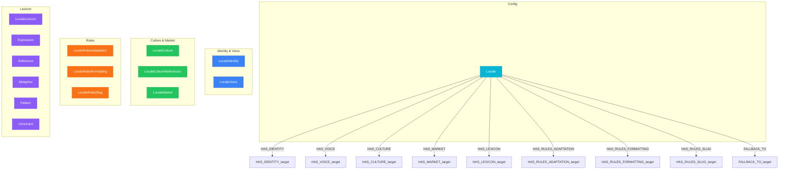

# Global Layer View

> Generated from `models/views/global-layer.yaml`
> Last updated: 2026-01-30

## Overview

The Global scope contains nodes shared across ALL projects.
This is the foundation for native content generation.

**15 nodes organized by category:**
- **Config (1)**: Locale - the root configuration node
- **Knowledge (14)**: LocaleIdentity, LocaleVoice, LocaleCulture, LocaleMarket,
  LocaleLexicon, and supporting data nodes (Expression, Reference, etc.)

**Key insight:**
Global nodes are NEVER project-specific. They represent knowledge ABOUT locales,
not content IN locales. This knowledge enables LLMs to generate natively.


## Graph Diagram



## Nodes

| Node | Layer |
|------|-------|
| Locale | Config |
| LocaleIdentity | Identity & Voice |
| LocaleVoice | Identity & Voice |
| LocaleCulture | Culture & Market |
| LocaleCultureReferences | Culture & Market |
| LocaleMarket | Culture & Market |
| LocaleRulesAdaptation | Rules |
| LocaleRulesFormatting | Rules |
| LocaleRulesSlug | Rules |
| LocaleLexicon | Lexicon |
| Expression | Lexicon |
| Reference | Lexicon |
| Metaphor | Lexicon |
| Pattern | Lexicon |
| Constraint | Lexicon |

## Relations

| Relation | Direction |
|----------|-----------|
| HAS_IDENTITY | outgoing |
| HAS_VOICE | outgoing |
| HAS_CULTURE | outgoing |
| HAS_MARKET | outgoing |
| HAS_LEXICON | outgoing |
| HAS_RULES_ADAPTATION | outgoing |
| HAS_RULES_FORMATTING | outgoing |
| HAS_RULES_SLUG | outgoing |
| FALLBACK_TO | outgoing |

## Cypher Queries

### Load complete locale knowledge

Get all knowledge for native generation in a locale

```cypher
MATCH (l:Locale {key: $locale})
OPTIONAL MATCH (l)-[:HAS_IDENTITY]->(li:LocaleIdentity)
OPTIONAL MATCH (l)-[:HAS_VOICE]->(lv:LocaleVoice)
OPTIONAL MATCH (l)-[:HAS_CULTURE]->(lc:LocaleCulture)
OPTIONAL MATCH (l)-[:HAS_MARKET]->(lm:LocaleMarket)
OPTIONAL MATCH (l)-[:HAS_LEXICON]->(lex:LocaleLexicon)
RETURN l.key AS locale,
       li.display_name AS name,
       lv.formality_score AS formality,
       lc.cultural_values AS values,
       lm.currency_code AS currency
```

**Parameters:**
- `locale`: "fr-FR"

### Get expressions for semantic field

Load domain expressions for content generation

```cypher
MATCH (l:Locale {key: $locale})-[:HAS_LEXICON]->(lex:LocaleLexicon)
MATCH (lex)-[:HAS_EXPRESSION]->(e:Expression)
WHERE e.semantic_field IN $fields
RETURN e.text AS expression,
       e.semantic_field AS field,
       e.register AS register
ORDER BY e.priority DESC
```

**Parameters:**
- `locale`: "fr-FR"
- `fields`: ["urgency","value","trust"]

### Locale fallback chain

Get fallback locales for a given locale

```cypher
MATCH path = (l:Locale {key: $locale})-[:FALLBACK_TO*1..3]->(fallback:Locale)
RETURN [n IN nodes(path) | n.key] AS fallbackChain
```

**Parameters:**
- `locale`: "fr-CA"

## Notes

- Global nodes are shared across ALL projects - never duplicated
- LocaleKnowledge enables native generation, not translation
- Expressions are filtered by semantic_field for relevant context
- Fallback chain: fr-CA → fr-FR → en-US (example)

---

*Generated by NovaNet Unified View System v8.0.0*