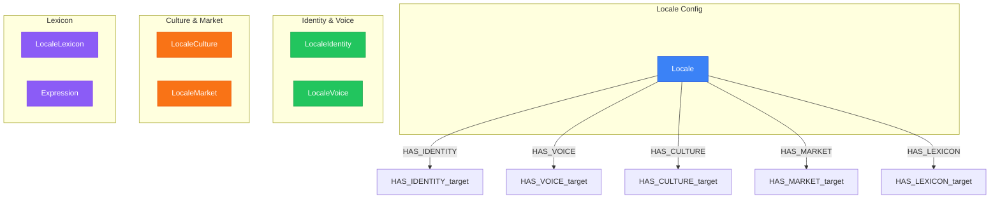

# Locale Knowledge View

> Generated from `models/views/locale-full-knowledge.yaml`
> Last updated: 2026-01-30

## Overview

Complete locale knowledge system for native content generation.
The LocaleKnowledge nodes provide cultural and linguistic context
that enables LLMs to generate content natively in each locale.

**14 LocaleKnowledge nodes organized by domain:**
- Identity: locale code, name, region, script
- Voice: formality, tone, directness, humor
- Culture: values, taboos, holidays, heroes
- Market: currency, payment methods, competitors
- Lexicon: domain-specific expressions and idioms


## Graph Diagram



## Nodes

| Node | Layer |
|------|-------|
| Locale | Locale Config |
| LocaleIdentity | Identity & Voice |
| LocaleVoice | Identity & Voice |
| LocaleCulture | Culture & Market |
| LocaleMarket | Culture & Market |
| LocaleLexicon | Lexicon |
| Expression | Lexicon |

## Relations

| Relation | Direction |
|----------|-----------|
| HAS_IDENTITY | outgoing |
| HAS_VOICE | outgoing |
| HAS_CULTURE | outgoing |
| HAS_MARKET | outgoing |
| HAS_LEXICON | outgoing |

## Cypher Queries

### Load complete locale knowledge

Get all locale knowledge for a specific locale

```cypher
MATCH (l:Locale {key: $locale})
OPTIONAL MATCH (l)-[:HAS_IDENTITY]->(li:LocaleIdentity)
OPTIONAL MATCH (l)-[:HAS_VOICE]->(lv:LocaleVoice)
OPTIONAL MATCH (l)-[:HAS_CULTURE]->(lc:LocaleCulture)
OPTIONAL MATCH (l)-[:HAS_MARKET]->(lm:LocaleMarket)
RETURN l.key AS locale,
       li.display_name AS name,
       lv.formality_score AS formality,
       lc.cultural_values AS values,
       lm.currency_code AS currency
```

**Parameters:**
- `locale`: "fr-FR"

### Load expressions by semantic field

Get domain-specific expressions for content generation

```cypher
MATCH (l:Locale {key: $locale})-[:HAS_LEXICON]->(lex:LocaleLexicon)
MATCH (lex)-[:HAS_EXPRESSION]->(e:Expression)
WHERE e.semantic_field IN $fields
RETURN e.text AS expression,
       e.semantic_field AS field,
       e.register AS register,
       e.usage_context AS context
ORDER BY e.semantic_field, e.priority DESC
```

**Parameters:**
- `locale`: "fr-FR"
- `fields`: ["urgency","value","trust"]

## Notes

- LocaleKnowledge is GLOBAL - shared across all projects
- Expressions are filtered by semantic_field for relevant context
- Priority filters ensure only high-value knowledge is included

---

*Generated by NovaNet Unified View System v8.0.0*