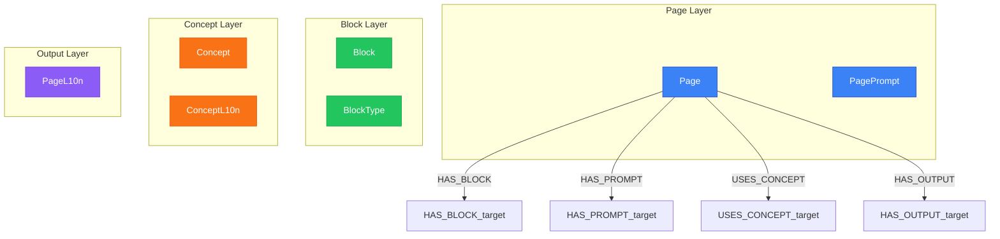

# Page Generation Context

> Generated from `models/views/page-generation-context.yaml`
> Last updated: 2026-01-30

## Overview

Context loading for the orchestrator agent when generating a complete page.
This view retrieves:
- The page definition and its prompt
- All blocks with their positions
- Related concepts via spreading activation
- Locale-specific knowledge for native generation


## Graph Diagram



## Nodes

| Node | Layer |
|------|-------|
| Page | Page Layer |
| PagePrompt | Page Layer |
| Block | Block Layer |
| BlockType | Block Layer |
| Concept | Concept Layer |
| ConceptL10n | Concept Layer |
| PageL10n | Output Layer |

## Relations

| Relation | Direction |
|----------|-----------|
| HAS_BLOCK | outgoing |
| HAS_PROMPT | outgoing |
| USES_CONCEPT | outgoing |
| HAS_OUTPUT | outgoing |

## Cypher Queries

### Load page context for generation

Complete context for orchestrator to generate a page

```cypher
MATCH (p:Page {key: $pageKey})
MATCH (p)-[:HAS_PROMPT]->(pp:PagePrompt)
OPTIONAL MATCH (p)-[:HAS_BLOCK]->(b:Block)
OPTIONAL MATCH (p)-[:USES_CONCEPT]->(c:Concept)
OPTIONAL MATCH (c)-[:HAS_L10N]->(cl:ConceptL10n)-[:FOR_LOCALE]->(l:Locale {key: $locale})
RETURN p, pp,
       collect(DISTINCT b) AS blocks,
       collect(DISTINCT {concept: c.key, title: cl.title}) AS concepts
```

**Parameters:**
- `pageKey`: "page-pricing"
- `locale`: "fr-FR"

### Load page with locale knowledge

Get page context with full locale knowledge for generation

```cypher
MATCH (p:Page {key: $pageKey})
MATCH (l:Locale {key: $locale})
OPTIONAL MATCH (l)-[:HAS_VOICE]->(lv:LocaleVoice)
OPTIONAL MATCH (l)-[:HAS_CULTURE]->(lc:LocaleCulture)
RETURN p.key AS page,
       lv.formality_score AS formality,
       lc.cultural_values AS values
```

**Parameters:**
- `pageKey`: "page-pricing"
- `locale`: "fr-FR"

## Notes

- The orchestrator uses this context to dispatch block generation tasks
- Spreading activation depth is 2 for related concepts
- Only active prompts are included

---

*Generated by NovaNet Unified View System v8.0.0*