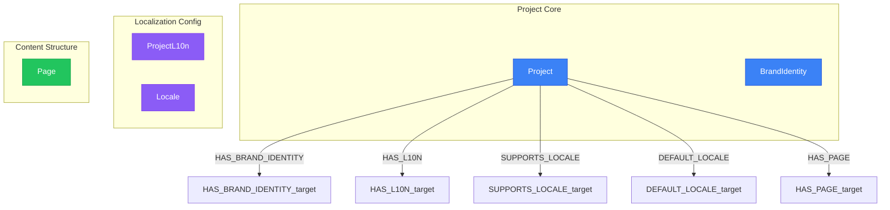

# Project Context View

> Generated from `models/views/project-context.yaml`
> Last updated: 2026-01-30

## Overview

Project-level view showing boundaries and configuration for multi-project management.
Use this view to understand:
- Which locales a project supports
- The project's brand identity
- All pages belonging to the project


## Graph Diagram



## Nodes

| Node | Layer |
|------|-------|
| Project | Project Core |
| BrandIdentity | Project Core |
| ProjectL10n | Localization Config |
| Locale | Localization Config |
| Page | Content Structure |

## Relations

| Relation | Direction |
|----------|-----------|
| HAS_BRAND_IDENTITY | outgoing |
| HAS_L10N | outgoing |
| SUPPORTS_LOCALE | outgoing |
| DEFAULT_LOCALE | outgoing |
| HAS_PAGE | outgoing |

## Cypher Queries

### Load project with supported locales

Get project info with all supported locales

```cypher
MATCH (p:Project {key: $projectKey})
OPTIONAL MATCH (p)-[:HAS_BRAND_IDENTITY]->(bi:BrandIdentity)
OPTIONAL MATCH (p)-[:SUPPORTS_LOCALE]->(l:Locale)
OPTIONAL MATCH (p)-[:DEFAULT_LOCALE]->(dl:Locale)
RETURN p.key AS project,
       p.name AS name,
       bi.primary_color AS brandColor,
       dl.key AS defaultLocale,
       collect(DISTINCT l.key) AS supportedLocales
```

**Parameters:**
- `projectKey`: "qrcode-ai"

### Project page inventory

List all pages for a project with their status

```cypher
MATCH (p:Project {key: $projectKey})-[:HAS_PAGE]->(page:Page)
RETURN page.key AS pageKey,
       page.status AS status,
       page.priority AS priority
ORDER BY page.priority DESC, page.key
```

**Parameters:**
- `projectKey`: "qrcode-ai"

### Multi-project overview

Get all projects with their page counts

```cypher
MATCH (p:Project)
OPTIONAL MATCH (p)-[:HAS_PAGE]->(page:Page)
RETURN p.key AS project,
       p.name AS name,
       count(page) AS pageCount
ORDER BY pageCount DESC
```

## Notes

- Each Project has a unique key used for routing and identification
- BrandIdentity contains visual identity (colors, logos, typography)
- ProjectL10n contains localized project metadata (tagline, description)

---

*Generated by NovaNet Unified View System v8.0.0*