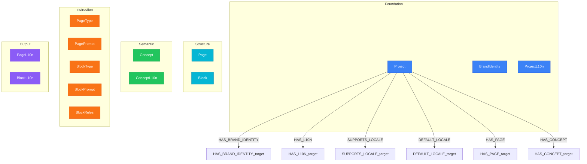

# Project Layer View

> Generated from `models/views/project-layer.yaml`
> Last updated: 2026-01-30

## Overview

The Project scope contains all nodes specific to a single project.
This is where content generation happens.

**14 nodes organized by category:**
- **Foundation (3)**: Project, BrandIdentity, ProjectL10n
- **Structure (2)**: Page, Block
- **Semantic (2)**: Concept, ConceptL10n
- **Instruction (5)**: PageType, PagePrompt, BlockType, BlockPrompt, BlockRules
- **Output (2)**: PageL10n, BlockL10n

**Key insight:**
The Project layer is where invariant structure meets localized output.
Pages and Blocks are invariant scaffolding; PageL10n and BlockL10n are generated.


## Graph Diagram



## Nodes

| Node | Layer |
|------|-------|
| Project | Foundation |
| BrandIdentity | Foundation |
| ProjectL10n | Foundation |
| Page | Structure |
| Block | Structure |
| Concept | Semantic |
| ConceptL10n | Semantic |
| PageType | Instruction |
| PagePrompt | Instruction |
| BlockType | Instruction |
| BlockPrompt | Instruction |
| BlockRules | Instruction |
| PageL10n | Output |
| BlockL10n | Output |

## Relations

| Relation | Direction |
|----------|-----------|
| HAS_BRAND_IDENTITY | outgoing |
| HAS_L10N | outgoing |
| SUPPORTS_LOCALE | outgoing |
| DEFAULT_LOCALE | outgoing |
| HAS_PAGE | outgoing |
| HAS_CONCEPT | outgoing |

## Cypher Queries

### Project overview

Get project with all pages and locale support

```cypher
MATCH (p:Project {key: $projectKey})
OPTIONAL MATCH (p)-[:HAS_BRAND_IDENTITY]->(bi:BrandIdentity)
OPTIONAL MATCH (p)-[:SUPPORTS_LOCALE]->(l:Locale)
OPTIONAL MATCH (p)-[:DEFAULT_LOCALE]->(dl:Locale)
OPTIONAL MATCH (p)-[:HAS_PAGE]->(page:Page)
RETURN p.key AS project,
       p.name AS name,
       bi.primary_color AS brandColor,
       dl.key AS defaultLocale,
       collect(DISTINCT l.key) AS supportedLocales,
       collect(DISTINCT page.key) AS pages
```

**Parameters:**
- `projectKey`: "qrcode-ai"

### Page with blocks

Get page structure with all blocks

```cypher
MATCH (p:Project {key: $projectKey})-[:HAS_PAGE]->(page:Page {key: $pageKey})
OPTIONAL MATCH (page)-[:HAS_BLOCK]->(b:Block)
OPTIONAL MATCH (b)-[:OF_TYPE]->(bt:BlockType)
RETURN page.key AS page,
       collect({
         key: b.key,
         type: bt.name,
         position: b.position
       }) AS blocks
ORDER BY b.position
```

**Parameters:**
- `projectKey`: "qrcode-ai"
- `pageKey`: "page-pricing"

### Generation context

Load full context for generating a page

```cypher
MATCH (p:Project {key: $projectKey})-[:HAS_PAGE]->(page:Page {key: $pageKey})
MATCH (page)-[:HAS_PROMPT]->(pp:PagePrompt)
OPTIONAL MATCH (page)-[:HAS_BLOCK]->(b:Block)
OPTIONAL MATCH (b)-[:USES_CONCEPT]->(c:Concept)
OPTIONAL MATCH (c)-[:HAS_L10N]->(cl:ConceptL10n)-[:FOR_LOCALE]->(l:Locale {key: $locale})
RETURN page.key AS page,
       pp.instructions AS instructions,
       collect(DISTINCT b.key) AS blocks,
       collect(DISTINCT {concept: c.key, title: cl.title}) AS concepts
```

**Parameters:**
- `projectKey`: "qrcode-ai"
- `pageKey`: "page-pricing"
- `locale`: "fr-FR"

### Concept network

Get concepts with semantic links

```cypher
MATCH (p:Project {key: $projectKey})-[:HAS_CONCEPT]->(c:Concept)
OPTIONAL MATCH (c)-[sl:SEMANTIC_LINK]->(related:Concept)
WHERE sl.temperature >= 0.3
RETURN c.key AS concept,
       collect({
         related: related.key,
         type: sl.type,
         temperature: sl.temperature
       }) AS links
```

**Parameters:**
- `projectKey`: "qrcode-ai"

## Notes

- Project nodes are per-project - each project has its own instances
- Invariant nodes (Page, Block, Concept) are defined once per project
- Localized nodes (*L10n) are generated for each supported locale
- The orchestrator uses this view to coordinate generation
- Output nodes (PageL10n, BlockL10n) are LLM-generated, not human-written

---

*Generated by NovaNet Unified View System v8.0.0*